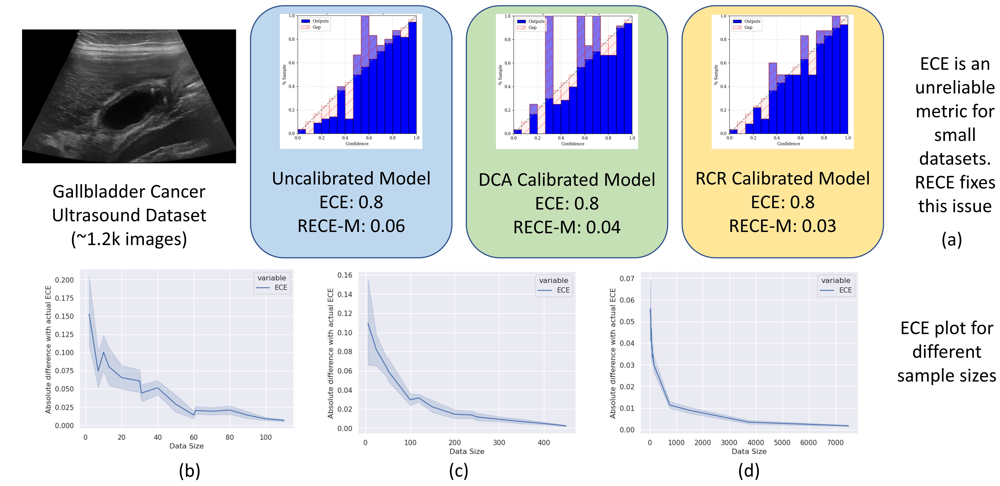

# Robust Calibration: How Reliable are the Metrics Used for Assessing Reliability in Medical Imaging?

This is the official PyTorch implementation for the paper: "How Reliable are the Metrics Used for Assessing Reliability in Medical Imaging?".

## Abstract
Deep Neural Networks DNNS have been successful in various computer vision tasks, but are known to be uncalibrated, and make overconfident mistakes. This erodes a user's confidence in the model and is a major concern in their applicability for critical tasks like medical imaging. In the last few years, researchers have proposed various metrics to measure miscalibration, and techniques to calibrate DNNS. However, our investigation shows that for small datasets, typical for medical imaging tasks, the common metrics for calibration, have a large bias as well as variance. It makes these metrics highly unreliable, and unusable for medical imaging. Similarly, we show that state-of-the-art (SOTA) calibration techniques while effective on large natural image datasets, are ineffective on small medical imaging datasets. We discover that the reason for failure is large variance in the density estimation using a small sample set. We propose a novel evaluation metric that incorporates the inherent uncertainty in the predicted confidence, and regularizes the density estimation using a parametric prior model. We call our metric, Robust Expected Calibration Error (RECE), which gives a low bias, and low variance estimate of the expected calibration error, even on the small datasets. In addition, we propose a novel auxiliary loss - Robust Calibration Regularization (RCR) which rectifies the above issues to calibrate the model at train time. We demonstrate the effectiveness of our RECE metric as well as the RCR loss on several medical imaging datasets and achieve SOTA calibration results on both standard calibration metrics as well as RECE. We also show the benefits of using our loss on general classification datasets.



Above image shows comparison of calibration estimates computed using ECE vs. our proposed method (RECE). Commonly used metrics for measuring calibration are unreliable for small datasets. 

## Requirements

* Python 3.8
* PyTorch 1.8

Directly install using pip

```
 pip install -r requirements.txt
```

## Models:

The trained models used in the paper can be found here:
<a href="https://csciitd-my.sharepoint.com/:f:/g/personal/csy207571_iitd_ac_in/Eqw1L9xtJjdFrEXbreNrhi8B4jkiOd1tW2FXTgbE3vfLWg?e=CcLjki">Trained Models</a>

## Training scripts:

Before running the training or evalutation scripts make sure to download the required scripts and fill in the empty paths in the corresponding dataset file in the `datasets` folder. For eg. GBCU dataset requires several paths in  `dataset/gbc_usg.py` to be completed.
The command to train looks like below where each argument can be changed accordingly on how to train. Also refer to `dataset/__init__.py` and `models/__init__.py` for correct arguments to train with. Argument parser can be found in `utils/argparser.py`.

Train GBCNet on GBCU Dataset with RCR loss:
```
python train.py --dataset gbc_usg --model gbcnet --schedule-steps 80 120 --epochs 160 --loss FL+RCR --gamma 1.0 --beta 1.0 --lr 0.003
```

For other methods and datasets refer to the MDCA repository for scripts to run them. \\
Note: The GBCNet model requires additional initialization weights `gbcnet_init_weights.pth`. Refer to the repository for those: <a href="https://github.com/sbasu276/GBCNet">GBCNet</a>

## Evaluation scripts:

Evaluation scripts will have a similar format to the training scripts and require mostly similar arguments. 

Evaluate GBCNet checkpoint on GBCU Dataset:
```
python eval_tta.py --dataset gbc_usg --model gbcnet --checkpoint path/to/trained/model
```

## Post Hoc Calibration:

To do post-hoc calibration, we can use the following command.

`lr` and `patience` value is used for Dirichlet calibration. To change range of grid-search in dirichlet calibration, refer to `posthoc_rece.py`.
```
python posthoc_rece.py --dataset gbc_usg --model gbcnet --lr 0.001 --patience 5 --checkpoint path/to/your/trained/model
```

## Plots for data size vs metric value (Main figure and Ablations):

`plots` folder contains our experiments on various plots shown in the paper. Please refer to the scripts provided to run them.

## References:
The code is adapted from the following repositories:

[1] <a href="https://github.com/mdca-loss/MDCA-Calibration">mdca-loss/MDCA-Calibration </a>
[2] <a href="https://github.com/torrvision/focal_calibration">torrvision/focal_calibration</a>
[3] <a href="https://github.com/Jonathan-Pearce/calibration_library">Jonathan-Pearce/calibration_library</a>
